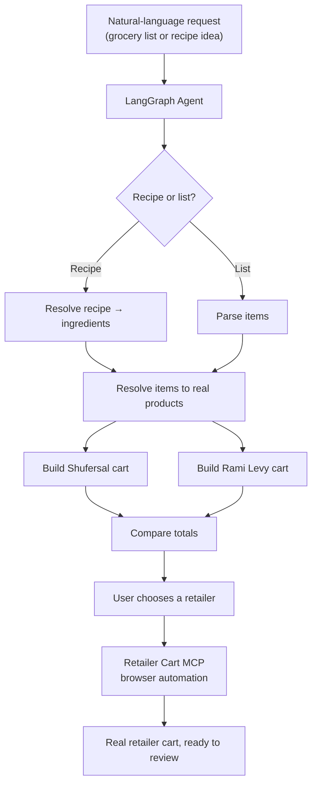
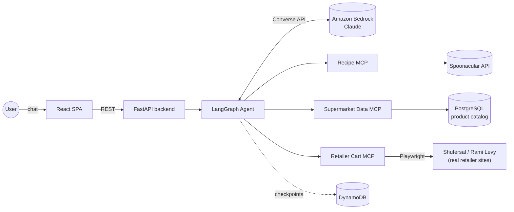
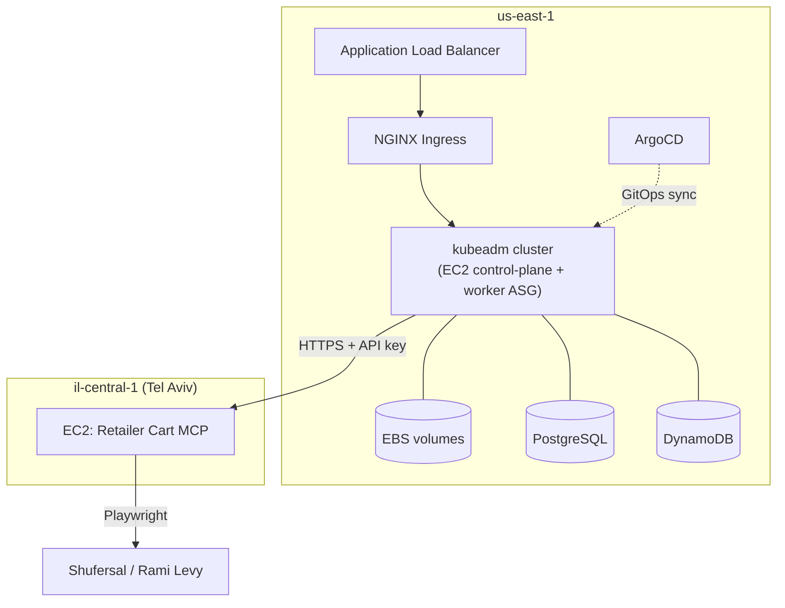
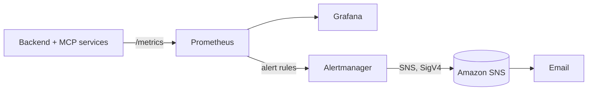
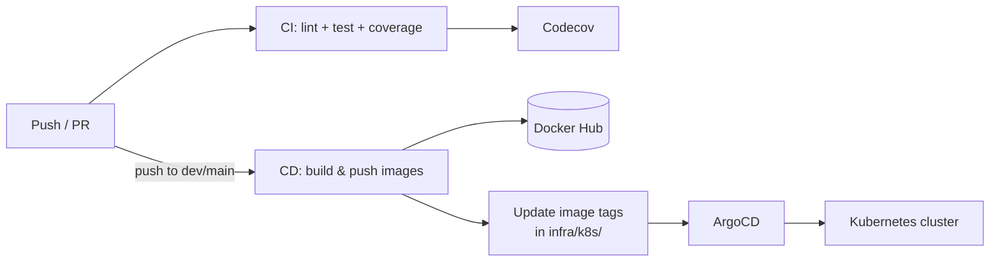

# AI Supermarket Shopping Assistant

[](https://github.com/moataz189/ai-supermarket-shopping-assistant/actions/workflows/ci.yml)
[](https://codecov.io/gh/moataz189/ai-supermarket-shopping-assistant)

An AI-powered shopping assistant that turns a natural-language grocery or recipe request into
two comparable supermarket carts, and can prepare the selected cart on the real retailer
website.

**Supported retailers:** Shufersal · Rami Levy

```
"I want pasta for 4 people"
        │
        ▼
recipe → ingredients → real supermarket products → two carts
        → price comparison → retailer selection → prepared cart
```

---

## The Problem

Grocery shopping across multiple retailers means repeating the same manual work every time:

- Searching for every item, one at a time
- Matching the right product (correct brand, size, variant)
- Checking what's actually in stock
- Comparing prices and package sizes across stores
- Calculating totals per store
- Building the final cart by hand

This project automates that workflow end-to-end, from a single natural-language request to a
ready-to-review cart on the retailer's own site — while keeping the user in control whenever
more than one product could reasonably match.

## How It Works



The agent asks for clarification whenever a request is ambiguous — for example, more than one
matching product, or a recipe with multiple plausible matches. **Checkout and payment are
never performed.** For a recipe-based request, the assistant can also show the recipe's own
cooking instructions once the cart is ready.

## Architecture



**Frontend** — React SPA (chat interface, clarification prompts, side-by-side cart comparison).

**Backend** — FastAPI, exposing a stateless `/chat` endpoint keyed by a LangGraph thread ID.

**Agent** — LangGraph graph orchestrating the flow above, backed by Amazon Bedrock (Claude) for
request understanding. Conversation checkpoints are kept in-memory in dev and in DynamoDB in
production.

**MCP servers** — three independent services, each exposing a small set of tools over the Model
Context Protocol:

| Server | Responsibility | Backed by |
|---|---|---|
| **Recipe MCP** | Recipe search, ingredients, cooking instructions | Spoonacular API |
| **Supermarket Data MCP** | Product search and pricing | PostgreSQL (Israeli supermarket price-transparency data) |
| **Retailer Cart MCP** | Drives the real retailer website and builds the cart | Playwright |

## Infrastructure

This project runs on **plain AWS EC2, not Amazon EKS.** The Kubernetes cluster is a manually
provisioned `kubeadm` cluster (one control-plane node + an Auto Scaling Group of workers),
provisioned and managed with Terraform.



- **AWS EC2** — control-plane and worker nodes, provisioned by **Terraform**.
- **Kubernetes** (`kubeadm`) — runs the backend, frontend, MCP servers (except Retailer Cart
  MCP), ingestion jobs, PostgreSQL, and the monitoring stack.
- **NGINX Ingress** behind an **ALB** — routes external traffic into the cluster.
- **ArgoCD** — GitOps deployment; syncs the cluster to whatever image tags are committed to the
  manifests in `infra/k8s/`.
- **Docker** / **Docker Hub** — every service is built into a container image and published to
  Docker Hub.
- **EBS** — persistent volumes for the cluster (e.g. PostgreSQL storage).
- **PostgreSQL** — production product catalog.
- **DynamoDB** — production LangGraph checkpoint store.

### Why Retailer Cart MCP runs separately, in Israel

The Retailer Cart MCP service runs on its **own EC2 instance in `il-central-1` (Tel Aviv)**,
outside the main cluster. Both Shufersal and Rami Levy block traffic at the CDN/WAF level when
it originates from `us-east-1` — confirmed independently via Playwright, a raw `curl` from the
EC2 host, and a side-by-side comparison against a non-AWS origin. This isn't a bug in the
adapters (they already refuse to guess and report a block instead); the sites simply won't
serve real content to that network origin. Running the browser automation from genuine
Israel-based infrastructure resolves this without masking traffic origin. The backend talks to
it over HTTPS with an API key; everything else (backend, other MCP servers, database,
monitoring) stays in `us-east-1`.

## Observability



Two dashboards, at two different levels:

- **FastAPI Observability** — framework-level HTTP metrics: request counts, latency
  percentiles, 2xx/5xx rates.
- **Backend Observability** — application-level metrics: chat request outcomes and duration,
  MCP call failures by service, requests by type, retailer selection counts, cart-preparation
  results, and Bedrock token usage for the request-classification step.

Alerting rules (backend error rate, backend/MCP unavailability, pod crash-looping) fire through
Alertmanager into an SNS topic, which delivers to email.

## Testing

The agent's LLM calls are inherently non-deterministic, so the test suite is built around
deterministic seams: the LangGraph nodes, the MCP servers, and the retailer cart automation are
each tested independently with fixed inputs and fixtures — including the Retailer Cart MCP,
which is exercised with a real headless Chromium (Playwright) against a local mock retailer
site, never a real one.

**534 tests** (pytest, `pytest-asyncio`), across:

| Layer | Location | Tests |
|---|---|---|
| Agent / LangGraph | `tests/agent/` | 257 |
| MCP servers (recipe, supermarket-data, retailer-cart + Playwright automation) | `tests/mcp/` | 168 |
| Feed ingestion | `tests/ingestion/` | 37 |
| API (FastAPI) | `tests/api/` | 18 |
| Database / product resolution | `tests/db/` | 18 |
| Dietary rules | `tests/dietary/` | 16 |

Representative scenarios covered: grocery-list and recipe flows, product ambiguity, missing
products, quantity handling, budget constraints, dietary constraints, retailer selection, cart
preparation, and failure handling (blocked sites, missing sessions, partial carts).

Linting is handled by **Ruff** (backend) and **oxlint** (frontend). Coverage is collected with
`pytest-cov` and tracked on every PR via Codecov (see badge above).

## CI/CD



- **CI** (`.github/workflows/ci.yml`) — runs on every PR into `main` and on pushes to `main`:
  Ruff lint, the full pytest suite with coverage, and a Codecov upload.
- **CD** (`.github/workflows/cd.yml`) — runs on pushes to `dev`/`main`: detects which services
  changed, builds and pushes only those Docker images to Docker Hub, then commits the new image
  tags into the relevant `infra/k8s/{dev,prod}` manifests. ArgoCD watches the repo and syncs the
  cluster automatically.
- The **Retailer Cart MCP** (il-central-1) is deployed separately, via a manual
  (`workflow_dispatch`) workflow that pulls and restarts its container over SSH — it isn't part
  of the Kubernetes/ArgoCD pipeline.
- A handful of additional manual workflows handle one-off infrastructure provisioning and
  secret rotation.

## Tech Stack

| Category | Technologies |
|---|---|
| AI / Agent | LangGraph, Amazon Bedrock (Claude) |
| Backend | FastAPI, Python, SQLAlchemy, Pydantic |
| Frontend | React, TypeScript, Vite, Tailwind CSS, Radix UI |
| Data | PostgreSQL, DynamoDB |
| MCP / Automation | Model Context Protocol, Playwright, Spoonacular API |
| Cloud / Infrastructure | AWS EC2, Kubernetes (kubeadm), Terraform, NGINX Ingress, ArgoCD, Docker, Docker Hub, EBS |
| CI/CD | GitHub Actions, Codecov |
| Observability | Prometheus, Grafana, Alertmanager, Amazon SNS |
| Testing | pytest, pytest-asyncio, pytest-cov, Ruff, Playwright, oxlint |

## Screenshots / Demo

_To add: chat UI, cart comparison view, and Grafana dashboard screenshots. Place image files
under `docs/images/` and reference them here._

## Project Scope & Safety

- The assistant **prepares carts only** — it never performs checkout, payment, or submits an
  order.
- Product data comes from the project's own catalog, ingested from Israeli supermarket
  price-transparency feeds into PostgreSQL in production; local/dev environments seed the
  catalog from fixture data instead of a live feed. This should not be treated as a guaranteed
  real-time store inventory feed.

---

## Local Development

```bash
make install   # install runtime + dev dependencies, plus Playwright's Chromium browser
make lint      # run ruff
make test      # run pytest
make coverage  # run pytest with terminal + XML coverage reports
make run       # run the FastAPI app locally
```

`make install` is enough on a freshly cloned checkout — no separate `playwright install` step
needed. It installs the Python packages and then runs `playwright install --with-deps
chromium` (Chromium only; that's the only browser engine this project launches), which
downloads the browser binary itself and, on Linux, its OS-level dependencies. Without this
step, the Retailer-Cart MCP tests (`tests/mcp/test_retailer_cart_automation.py` and
`tests/mcp/test_retailer_cart_mcp_contract.py`) fail with `BrowserType.launch: Executable
doesn't exist` — those tests drive a real headless Chromium against a local mock retailer
site (`tests/mcp/mock_site_server.py`), never a real retailer's website.

### Running with Docker

No local Python/Node toolchain needed — only Docker. This runs the **real** backend, all
three MCP servers, and the real Shufersal/Rami Levy adapters (the mock retailer site is
test-only, never part of this stack).

```bash
cp .env.example .env         # fill in BEDROCK_MODEL_ID, AWS_REGION, SPOONACULAR_API_KEY
mkdir -p sessions             # must exist (even empty) before `docker compose up`

docker compose --profile tools run --rm ingestion   # one-time: load fixture products into SQLite
docker compose up --build                           # first run: builds all 6 images
```

Open **http://localhost:3000**. Other useful commands:

```bash
docker compose up -d          # subsequent runs, detached (no rebuild needed unless code changed)
docker compose logs -f backend           # tail one service's logs
docker compose down                      # stop and remove containers (keeps the DB volume)
./scripts/smoke_test.sh                  # build + start + healthcheck + teardown, one shot
```

A valid `BEDROCK_MODEL_ID` (+ working AWS credentials via the local-only `~/.aws` mount) is
required for the agent to respond at all — the backend fails fast at startup if it's unset.
A valid `SPOONACULAR_API_KEY` is required for the recipe flow. A previously-captured session
under `./sessions/<environment>/<retailer>.json` (`login.py`, run locally, never in a
container; `<environment>` defaults to `prod`) is required for a real (non-`login_required`)
retailer-cart attempt.

Ports: web `3000`, backend `8000`, supermarket-mcp `8001`, recipe-mcp `8002`,
retailer-cart-mcp `8003`.

---

See [`docs/spec.md`](docs/spec.md) for the full design spec and [`docs/plan.md`](docs/plan.md)
for the implementation plan and checkpoint history.
